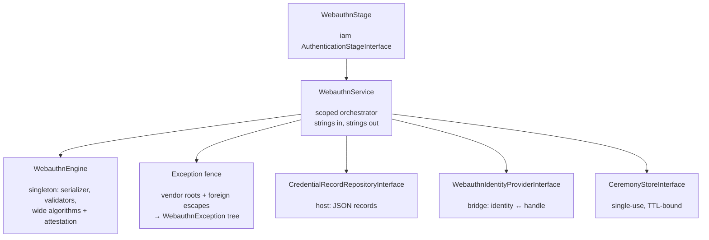

# phpdot/webauthn

> **This is an experimental package.** The API surface may change in any release without a
> deprecation cycle — pin the constraint and read the release notes before upgrading.

WebAuthn and passkeys for the PHPdot ecosystem — a production wrap of
[`web-auth/webauthn-lib`](https://github.com/web-auth/webauthn-lib): ceremony orchestration,
single-use TTL-bound challenges, duplicate-credential refusal, counter discipline after every
authentication, and an exception fence no vendor type leaks past. Storage is the host's, through
three small contracts; authentication plugs into [`phpdot/iam`](https://github.com/phpdot/iam)
as one stage.

## Table of Contents

- [Requirements](#requirements)
- [Installation](#installation)
- [Usage](#usage)
- [Storage contract](#storage-contract)
- [Architecture](#architecture)
- [Testing](#testing)
- [License](#license)

## Requirements

| Requirement | Constraint |
|---|---|
| PHP | `>= 8.5` |
| `ext-json` | `*` |
| `ext-openssl` | `*` |
| `paragonie/constant_time_encoding` | `^2.6 \|\| ^3.0` |
| `phpdot/contracts` | `^0.3` |
| `psr/clock` | `^1.0` |
| `symfony/serializer` | `^8.0` |
| `web-auth/cose-lib` | `^4.7` |
| `web-auth/webauthn-lib` | `^5.3` |

`phpdot/iam` (dev-only suggestion) enables the `WebauthnStage` bridge; `phpdot/container` for the binding attributes.

## Installation

```bash
composer require phpdot/webauthn
```

## Usage

Strings in, strings out. Begin a ceremony and hand the JSON to the browser; take the browser's
credential JSON back and finish:

```php
$optionsJson = $webauthn->beginRegistration($user);       // → publicKey.create options (user = WebauthnUser)
$recordJson  = $webauthn->finishRegistration($user, $json);  // validates, refuses duplicates, persists

$optionsJson = $webauthn->beginAuthentication($user->handle);  // → publicKey.get options
$handle      = $webauthn->finishAuthentication($json);          // validates, saves the counter, answers the handle
```

`beginAuthentication(null)` starts a discoverable (passkey, usernameless) ceremony. The core
speaks users and handles, never identities — mapping a handle to your actor is the caller's
one line.

As an iam factor, that line is the bridge: `WebauthnStage` + your
`WebauthnIdentityProviderInterface` mapping — passkeys work as the identifying factor or as a
step-up after a password:

```php
$engine = new AuthenticationEngine(
    [new PasswordStage(...), new WebauthnStage($webauthn, $identityProvider)],
    $policy,
    $store,
);
```

Configuration arrives through the `#[Config('webauthn')]` DTO — `rpId`, `rpName`,
`allowedOrigins` (mandatory: an empty origin list refuses to construct rather than fall back
to the library's looser deprecated origin check), the COSE algorithm set (shipped wide:
ES256/384/512, RS256/384/512, PS256/384/512, Ed25519), challenge bytes (minimum 16, default
32), and the ceremony TTL (default 300s on the injected PSR-20 clock).

## Storage contract

The package owns the ceremonies; the host owns storage, through two contracts plus the handle mapping.

- **`CredentialRecordRepositoryInterface`** — records travel as JSON strings (the package
  serializes `CredentialRecord` itself; the host's burden is a JSON column). Terms: credential
  ids are unique across all users; a record is saved after **every** authentication — the
  signature counter is the clone detector, and an unsaved record silently disarms it; payloads
  are opaque to the host.
- **Handles, not identities** — the core never knows an identity type. The user handle is
  the host's to mint and keep: stable, opaque, at most 64 raw bytes, never recycled across
  accounts — it is what binds a credential to a user across both ceremonies. With iam, the
  bridge's `WebauthnIdentityProviderInterface` maps handles to identities.
- **`CeremonyStoreInterface`** — per-ceremony state keyed by challenge, readable exactly once.
  Single-use is the replay protection (the library only compares challenges) and the TTL
  bounds what hangs. Default: `SessionCeremonyStore`, namespaced session keys.

## Architecture

`WebauthnEngine` (singleton) builds the library once — serializer, wide attestation support
(none **and packed**: real passkey clients ignore a `none` preference, a spec SHOULD, and would
otherwise hard-fail at parse time), the wide algorithm manager, and both validators; nothing is
touched after build. `WebauthnService` (scoped) orchestrates: challenge generation, single-use
state, the duplicate refusal the library never performs, the mandatory counter write, and the
exception fence — the library's two disjoint exception roots plus foreign CBOR/cose escapes all
translate to `PHPdot\WebAuthn\Exception\WebauthnException` and its leaves.



## Testing

```bash
composer install
composer test        # PHPUnit
composer analyse     # PHPStan, level max + strict rules
composer cs-check    # PHP-CS-Fixer
composer check       # All three
```

## License

MIT.

**This repository is a read-only mirror**, generated by CI from
[phpdot/monorepo](https://github.com/phpdot/monorepo). [Pull requests](https://github.com/phpdot/monorepo/pulls)
and [issues](https://github.com/phpdot/monorepo/issues) belong in the monorepo.
